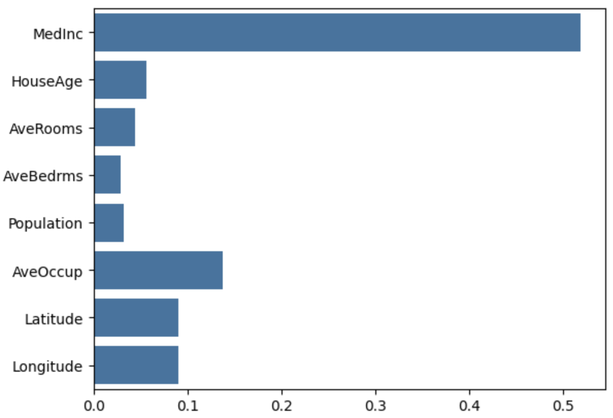

# California Housing Price Prediction


## Description

This project predicts the median house value for census block groups in California using the Scikit-learn dataset. It follows a complete machine learning workflow, including:
* Exploratory Data Analysis (EDA) to understand the data's structure and quirks.
* Data preprocessing to handle extreme outliers and skewed distributions.
* Training and comparing a baseline `LinearRegression` model with a more advanced `RandomForestRegressor`.
* Evaluating the models using R², MAE, and RMSE scores and interpreting the results.

## Key Findings & Results

* The EDA revealed significant outliers in the `AveRooms` and `AveOccup` features, which were removed to improve model stability. The `Population` feature was found to be heavily right-skewed and was normalized using a **log transform**.

* A baseline `LinearRegression` model was able to explain **~61%** of the variance in house prices (R² score). To capture more complex, non-linear patterns, a `RandomForestRegressor` was trained, which significantly improved performance to an **R² score of ~81%**.

* Further evaluation of the Random Forest model showed a **Mean Absolute Error (MAE) of 0.3325**, indicating that, on average, its predictions are off by approximately **$33,250**. The **Root Mean Squared Error (RMSE) was 0.5032**. The fact that the RMSE is notably higher than the MAE suggests that while most predictions are accurate, the model makes a few predictions with large errors that are penalized more heavily by the RMSE metric.

* Feature importance analysis revealed that **Median Income (`MedInc`) is by far the most critical factor** in determining house prices.



## Technologies Used
* Python
* NumPy
* Pandas
* Matplotlib
* Seaborn
* Scikit-learn

## Getting Started

### Installation
1.  Clone the repository:
    ```sh
    git clone https://github.com/free-individual/DataScience.git
    ```
2.  Navigate into the project directory:
    ```sh
    cd DataScience/California Housing Price Prediction
    ```
3.  Install the required libraries using the `requirements.txt` file:
    ```sh
    pip install -r requirements.txt
    ```

### Usage
1.  Launch Jupyter Notebook from your terminal:
    ```sh
    jupyter notebook
    ```
2.  Open the `California Housing Price Prediction.ipynb` file and run the cells.
