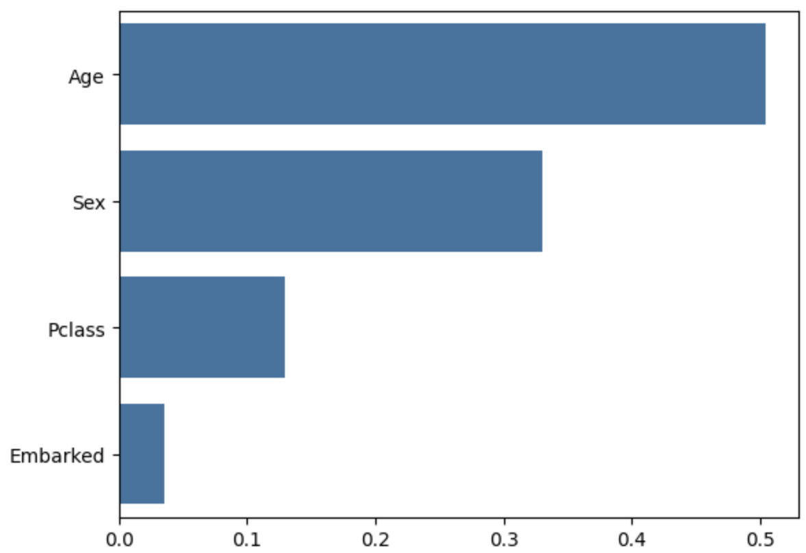
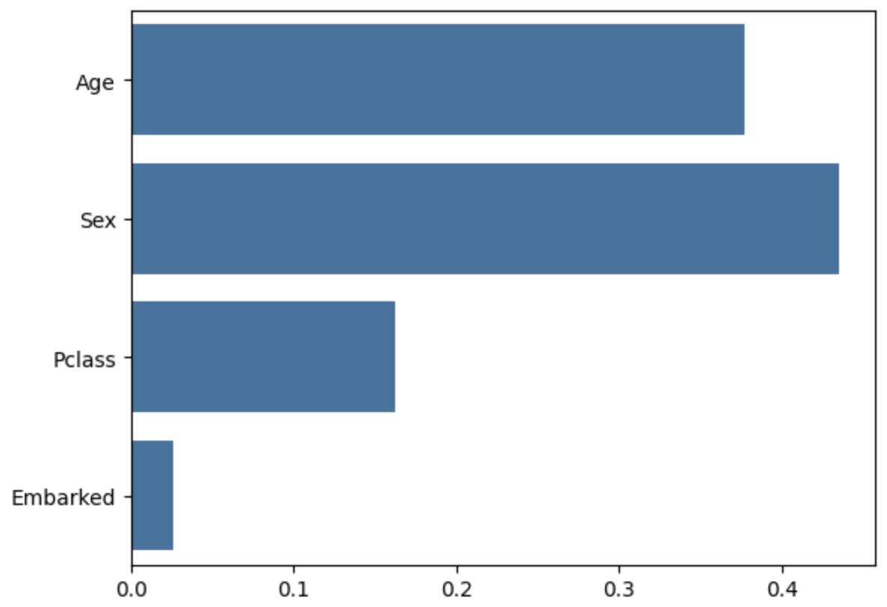

# Exploratory Data Analysis of Titanic Dataset


## Description

This project performs an exploratory data analysis (EDA) on the Titanic dataset to uncover factors influencing survival and builds classification models to predict whether a passenger survived.

### Analysis and Prediction
- **Notebook:** [`Titanic.ipynb`](./Titanic.ipynb)
- **Description:** The analysis begins with data cleaning and preprocessing, including handling missing values in the 'Embarked' and 'Age' columns. A 'Title' feature is engineered from passenger names to improve age imputation. Several visualizations are created to explore the relationships between features like Sex, Passenger Class, and Port of Embarkation with survival rates. Finally, two models (`RandomForestClassifier` and `GradientBoostingClassifier`) are trained and evaluated to predict passenger survival and determine feature importance.

### Key Findings
- **Sex** and **Age** were identified as the most significant predictors of survival. Passenger Class (`Pclass`) was also a strong indicator.
- The `RandomForestClassifier` achieved an accuracy of **81%**.
- The `GradientBoostingClassifier` achieved a slightly higher accuracy of **83%**.

### RandomForestClassifier Feature Importances.


### GradientBoostingClassifier Feature Importances.


## Technologies Used
* Python
* Pandas
* Matplotlib
* Seaborn
* Scikit-learn

## Getting Started

### Pre Requisites
- Python 3.8 or higher
- Pip package manager
- Jupyter Notebook

- **Note:** The titanic dataset is included in the asssets folder but if you want to download it seperately you can do it at this link - [https://www.kaggle.com/datasets/yasserh/titanic-dataset](https://www.kaggle.com/datasets/yasserh/titanic-dataset)

### Installation
1. Clone the repository:
    ```sh
    git clone https://github.com/free-individual/DataScience.git
    ```

2. Navigate to the project directory:
    ```sh
    cd /DataScience/The Titanic Dataset
    ```

3. Install the required libraries from `requirements.txt`:
    ```sh
    pip install -r requirements.txt
    ```

### Usage
4. Launch Jupyter Notebook from your terminal:
    ```sh
    jupyter notebook
    ```

5. Open the `Titanic.ipynb` file and run the cells to see the analysis and model results.
